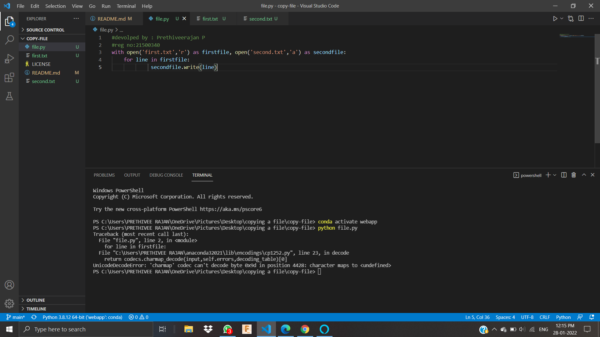
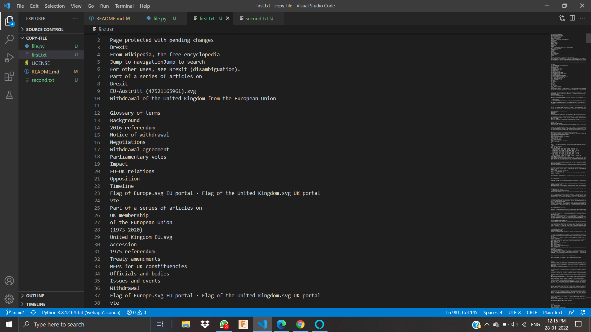
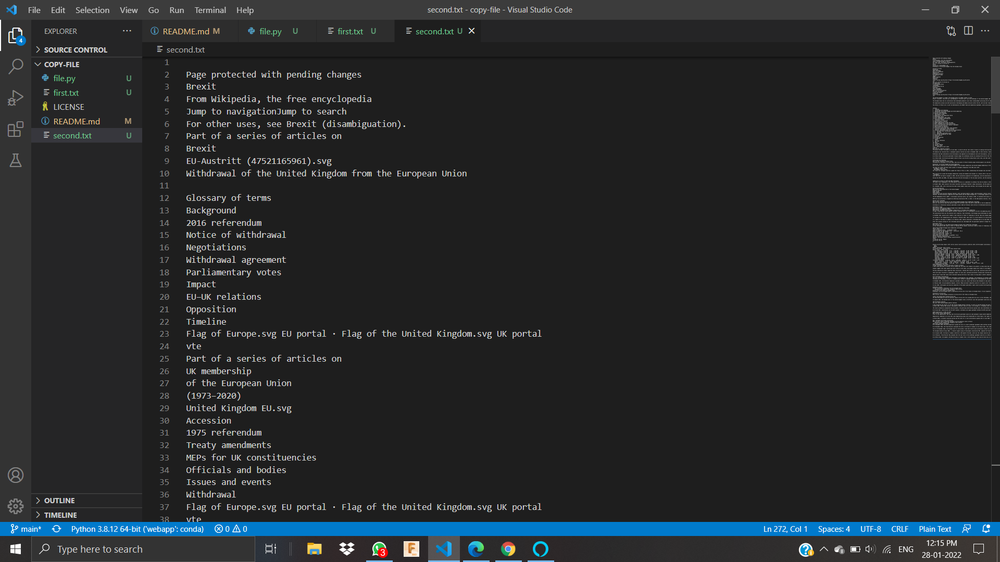

# copy-file
## AIM:
To write a python program for copying the contents from one file to another file.
## EQUIPEMENT'S REQUIRED: 
PC
Anaconda - Python 3.7
## ALGORITHM: 
### Step 1:
opening the first and second file
### Step 2: 
 using for loop with first file
### Step 3: 
then writing in second file 

## PROGRAM:
```
#devolped by : Prethiveerajan P
#reg no:21500340
with open('first.txt','r') as firstfile, open('second.txt','a') as secondfile:
    for line in firstfile:
             secondfile.write(line)
```

### OUTPUT OF PROGRAMM:

### OUTPUT OF FIRST.TXT:

### OUTPUT OF SECOND.TXT:



## RESULT:
Thus the program is written to copy the contents from one file to another file.